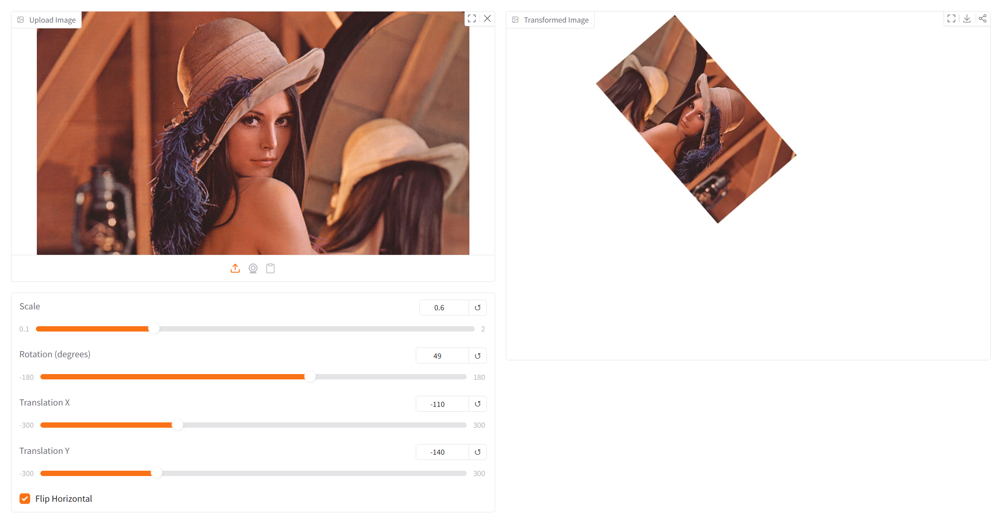
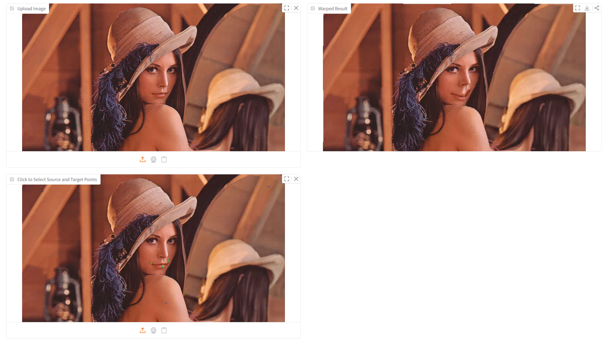

# Assignment1 - Image Warping

## Requirements

To install requirements:

```setup
pip install -r requirements.txt
```

## Running

To run basic transformation, run:

```basic
python run_global_transform.py
```

To run point guided transformation, run:

```point
python run_point_transform.py
```

## Results

### Basic Transformation


### Point Guided Deformation:


## Contributing

