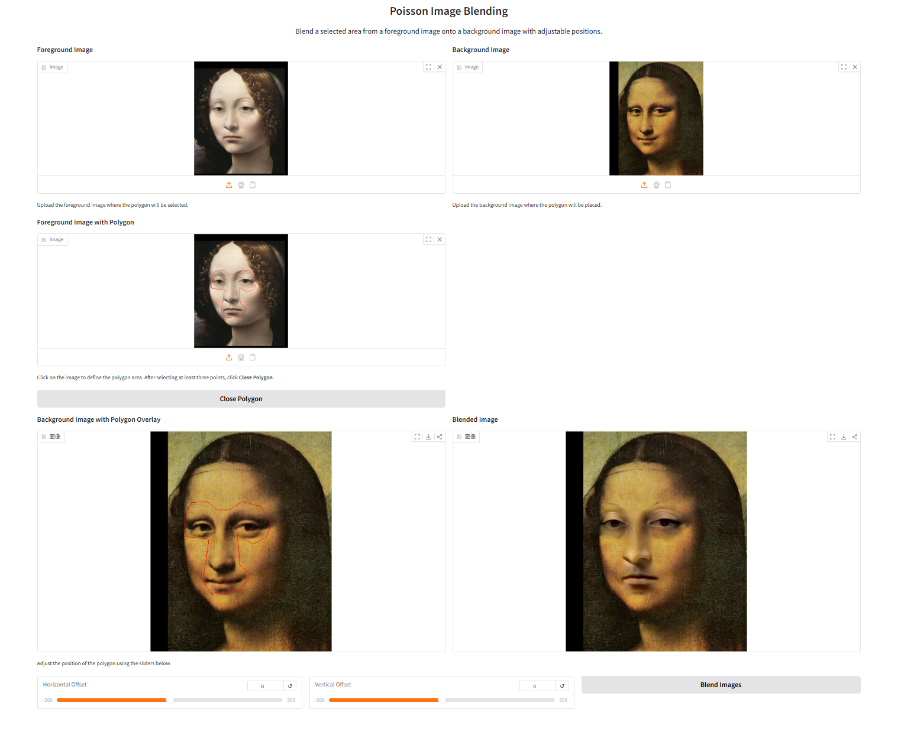
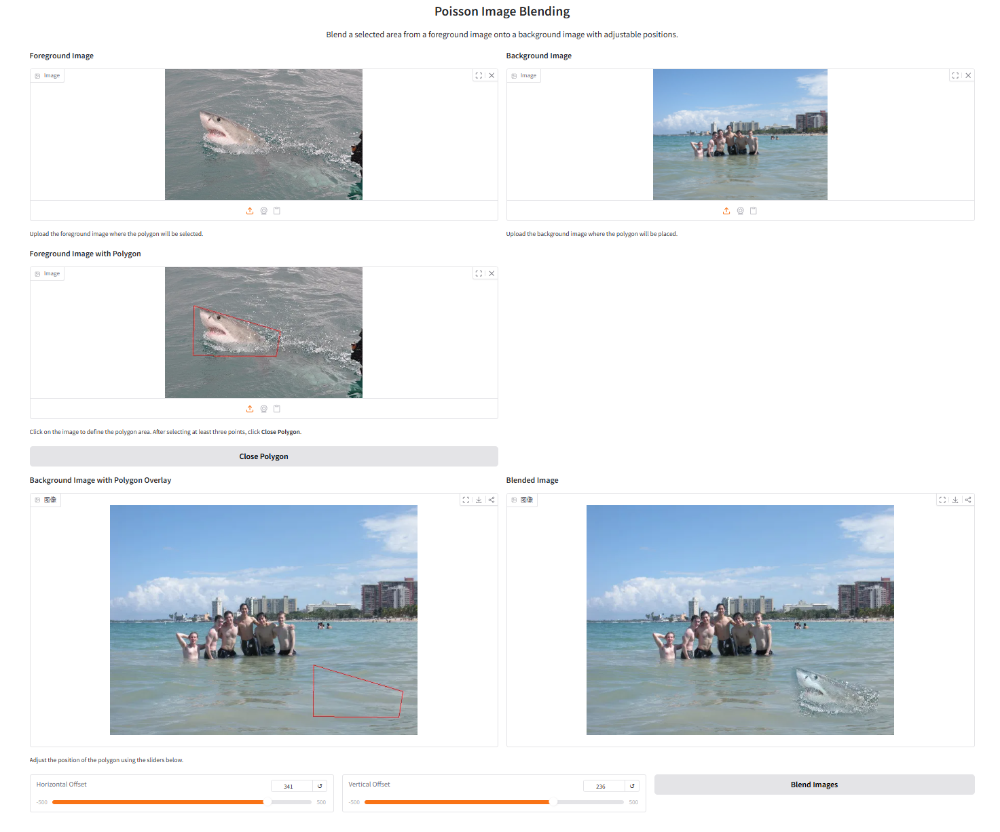

# Assignment 2 - DIP with PyTorch

## Requirements

To install requirements:

```setup
conda create -n dip python=3.10
conda activate dip
conda install pytorch torchvision torchaudio cudatoolkit=11.8 -c pytorch -c nvidia
conda install opencv numpy gradio
```

## Running

To run poisson image editing, run:

```basic
python run_global_transform.py
```

To Pix2Pix, run:

```point
cd Pix2Pix
python train.py
```

## Results

### Poisson Image Editing:




### Pix2Pix:
#### Pre-trained models:
See [checkpoints](./Pix2Pix/checkpoints)

#### Training results:
See [train_results](./Pix2Pix/train_results)

#### Validation results:
See [val_results](./Pix2Pix/val_results)

## Acknowledgement
>📋 Thanks for the algorithms proposed by
- [Paper: Poisson Image Editing](https://www.cs.jhu.edu/~misha/Fall07/Papers/Perez03.pdf)
- [Paper: Image-to-Image Translation with Conditional Adversarial Nets](https://phillipi.github.io/pix2pix/)
- [Paper: Fully Convolutional Networks for Semantic Segmentation](https://arxiv.org/abs/1411.4038)
