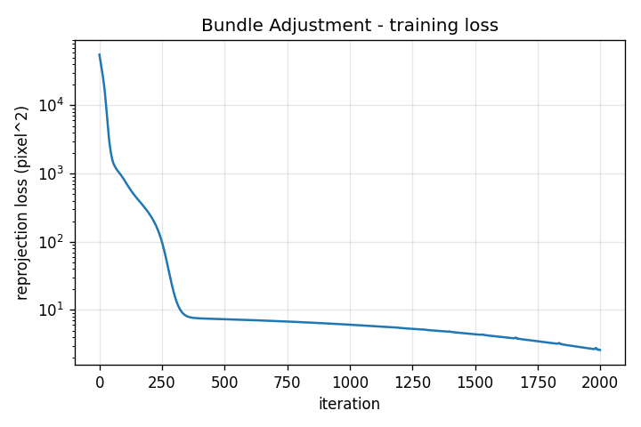
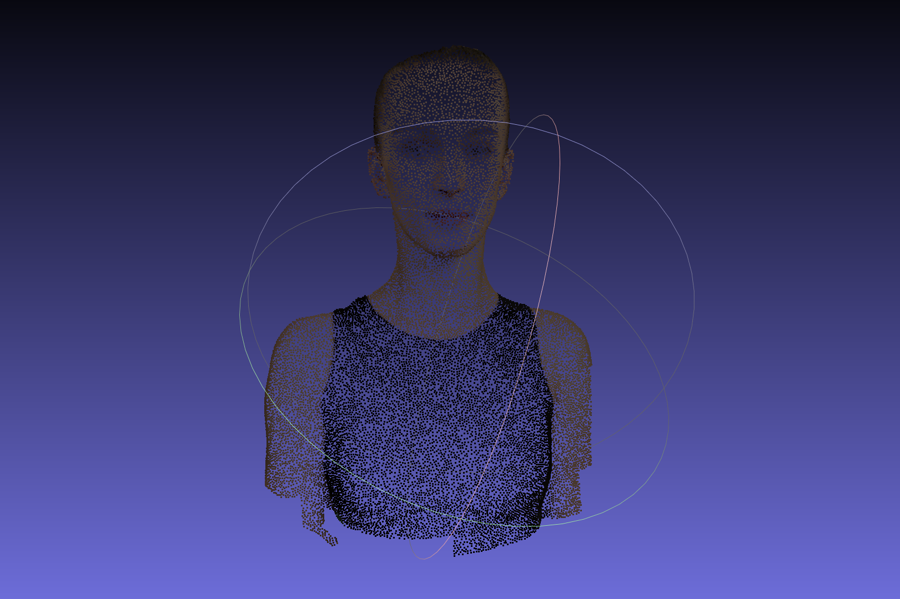
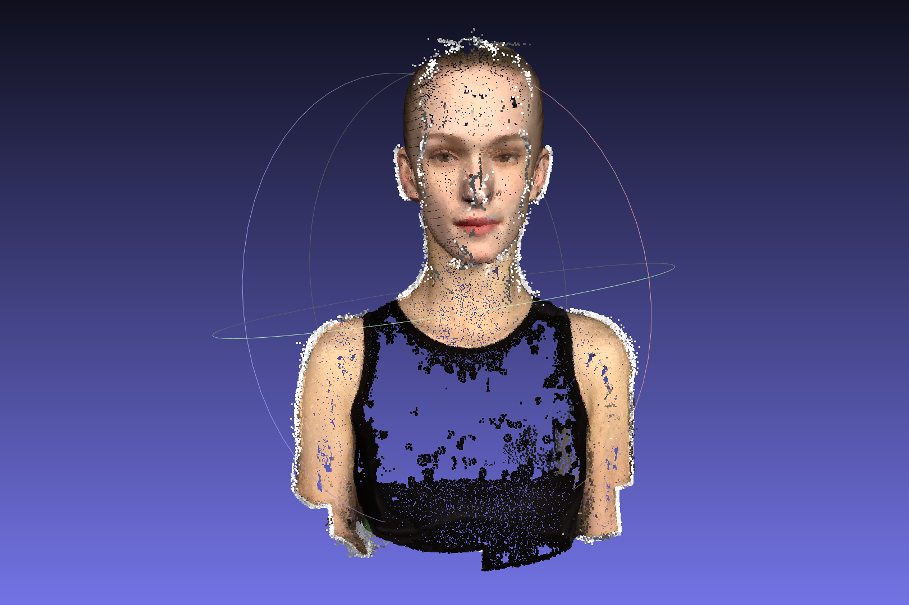

# Assignment 3: Bundle Adjustment

---

## Requirements

To install requirements:

```bash
conda create -n dip python=3.10
conda activate dip
conda install pytorch torchvision torchaudio cudatoolkit=11.8 -c pytorch -c nvidia
conda install opencv numpy matplotlib
```

## Running

To run the manual bundle adjustment pipeline, execute the main script:

```bash
python main.py
```

## Results

The execution results for Task 1 are generated and saved in the [outputs](./outputs) directory. The directory structure is as follows:

```text
outputs/
├── loss_curve.png             # Training loss curve
└── reconstruction.obj         # Reconstructed 3D point cloud
```

<div align="center">
  
  <p>Training Loss Curve</p>
  
  <br>

  
  <p>Reconstructed Point Cloud</p>
</div>


The execution results for Task 2 are generated and saved in the [colmap](./data/colmap) directory. The directory structure is as follows:

```text
├─dense
│  ├─images
│  ├─sparse
│  └─stereo
│      ├─consistency_graphs
│      ├─depth_maps
│      └─normal_maps
└─sparse
    └─0
```

<div align="center">
  
  <p>Mesh Reconstructed by Colmap</p>
</div>